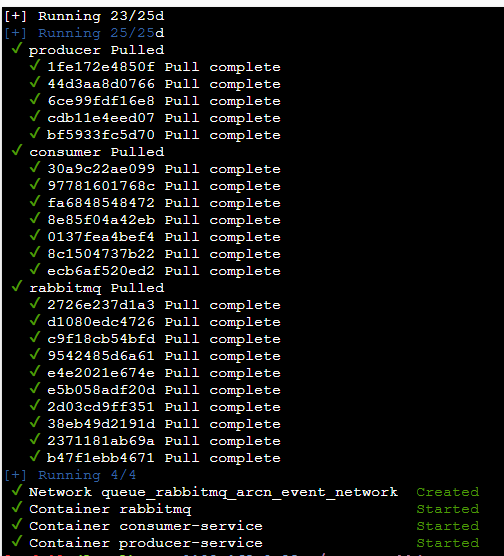
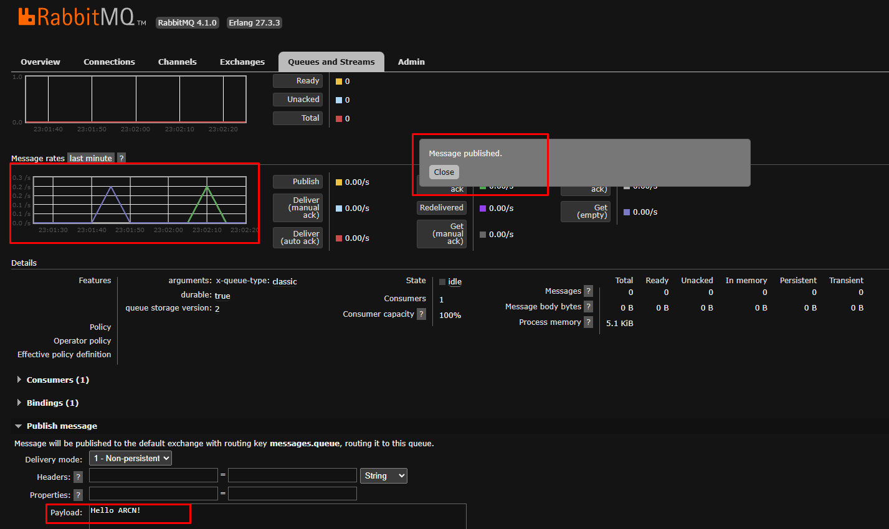
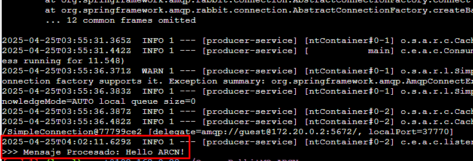
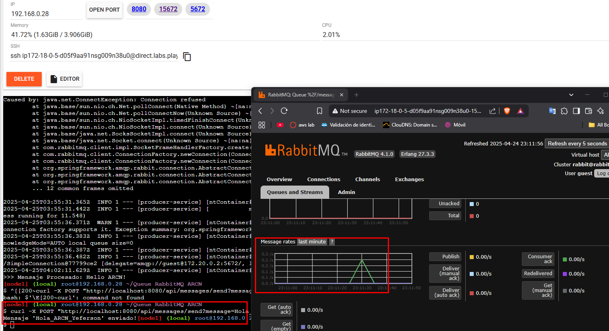

# PROYECTO AREP: Optimización de Sistemas Distribuidos: Integración de Redis y RabbitMQ para Mejorar Rendimiento y Eficiencia.

## ¿De qué trata el proyecto?
Este proyecto es una implementación de un sistema de mensajería basado en RabbitMQ utilizando Spring Boot. Consiste en un **Productor** que envía mensajes a un **Exchange** de RabbitMQ y un **Consumidor** que escucha y procesa los mensajes desde una cola. Es ideal para aprender y practicar conceptos de mensajería asíncrona y arquitectura basada en eventos.

El consumidor utiliza un componente llamado `MessageListener` que escucha mensajes desde una cola configurada en el archivo `application.properties` y los procesa, registrando los mensajes recibidos en los logs y mostrando un mensaje procesado en la consola.

---

## ¿Qué se requiere instalar?
Para ejecutar este proyecto, necesitas instalar:
1. **Java 17** o superior.
2. **Maven** (opcional, ya que el proyecto incluye un wrapper).
3. **Docker** y **Docker Compose** (para la ejecución en contenedores).
4. **RabbitMQ** (si no usas Docker, puedes instalarlo localmente).

---
## ¿Cómo correr desde docker?
1. Clona el repositorio:
   ```
   git clone <url-del-repositorio>
   cd Queue_RabbitMQ_ARCN
   ```
2. Ejecuta el docker-compose:
   ```
   docker-compose up -d
   ```
   se debería ver así:

   

---
## ¿Cómo se ejecuta el proyecto en local?
1. Clona el repositorio:
   ```
   git clone <url-del-repositorio>
   cd Queue_RabbitMQ_ARCN
   ```

2. Compila el proyecto con Maven:
   ```
   ./mvnw clean package
   ```

3. Inicia RabbitMQ localmente o mediante Docker:
   ```
   docker run -d --name rabbitmq -p 5672:5672 -p 15672:15672 rabbitmq:management
   ```

4. Ejecuta el **Productor**:
   ```
   java -jar producer-service/target/producer-service-0.0.1-SNAPSHOT.jar
   ```

5. Ejecuta el **Consumidor**:
   ```
   java -jar consumer-service/target/consumer-service-0.0.1-SNAPSHOT.jar
   ```

6. Accede a la API del productor para enviar mensajes:
   ```
   curl -X POST "http://localhost:8080/api/messages/send?message=HolaMundo"
   ```

7. Observa los mensajes procesados en los logs del consumidor y en la consola.

---

## ¿Qué arquitectura tiene?
El proyecto sigue una arquitectura basada en eventos:
- **Productor**: Envía mensajes a un **Exchange** de RabbitMQ.
- **RabbitMQ**: Actúa como intermediario, enruta los mensajes desde el productor hacia la cola.
- **Consumidor**: Escucha los mensajes desde la cola y los procesa utilizando el componente `MessageListener`.

---

## ¿Qué estructura tiene el proyecto?
El proyecto está organizado de la siguiente manera, incluyendo todos los microservicios y componentes relevantes:

```
Queue_RabbitMQ_ARCN/
├── producer-service/                           # Servicio Productor: envía mensajes a RabbitMQ
│   ├── src/
│   │   └── main/
│   │       ├── java/com/eci/arcn/producer_service/      # Código fuente del productor
│   │       └── resources/
│   │           └── application.properties               # Configuración del productor
│   └── target/                                         # Archivos generados por Maven
│
├── consumer-service/                           # Servicio Consumidor: recibe y procesa mensajes de RabbitMQ
│   ├── src/
│   │   └── main/
│   │       ├── java/com/eci/arcn/consumer_service/      # Código fuente del consumidor
│   │       │   └── listener/MessageListener.java        # Lógica para procesar mensajes
│   │       └── resources/
│   │           └── application.properties               # Configuración del consumidor
│   └── target/                                         # Archivos generados por Maven
│
├── delivery-service/                           # Microservicio de entregas
│   ├── src/
│   │   └── main/
│   │       ├── java/com/eci/arep/delivery_service/      # Código fuente del servicio de entregas
│   │       └── resources/
│   │           └── application.properties               # Configuración del servicio de entregas
│   └── target/                                         # Archivos generados por Maven
│
├── payment-service/                            # Microservicio de pagos
│   ├── src/
│   │   └── main/
│   │       ├── java/com/eci/arep/payment_service/       # Código fuente del servicio de pagos
│   │       └── resources/
│   │           └── application.properties               # Configuración del servicio de pagos
│   └── target/                                         # Archivos generados por Maven
│
├── restaurant-service/                         # Microservicio de restaurantes
│   ├── src/
│   │   └── main/
│   │       ├── java/com/eci/arep/restaurant_service/    # Código fuente del servicio de restaurantes
│   │       └── resources/
│   │           └── application.properties               # Configuración del servicio de restaurantes
│   └── target/                                         # Archivos generados por Maven
│
├── redis-service/                              # Servicio de Redis (si aplica)
│   └── ...                                     # Archivos y configuración para Redis
│
├── redis-services-send-rabbitMQ/               # Servicio para enviar mensajes a RabbitMQ usando Redis
│   └── ...                                     # Archivos y configuración
│
├── delivery-service-receive-rabbitMQ/          # Servicio para recibir mensajes de RabbitMQ en entregas
│   └── ...                                     # Archivos y configuración
│
├── consume_api_redis_rabbitMQ.py               # Script Python para consumir API y Redis con RabbitMQ
├── docker-compose.yml                          # Configuración para Docker Compose
├── .gitignore
├── pom.xml                                     # Archivo de configuración Maven raíz
└── README.md
```

- Cada microservicio cuenta con su propio código fuente y archivo de configuración.
- El archivo `docker-compose.yml` permite levantar todos los servicios y dependencias fácilmente.
- Existen scripts y servicios auxiliares para integración con Redis y pruebas.

> Esta estructura facilita la escalabilidad y el mantenimiento, siguiendo buenas prácticas de microservicios y separación de responsabilidades.

---

## Pruebas
El proyecto incluye pruebas básicas para verificar que el contexto de Spring Boot se carga correctamente:
1. Ejecuta las pruebas con Maven:
   ```
   ./mvnw test
   ```

2. Las pruebas están definidas en:
   - `ProducerServiceApplicationTests`
   - `ConsumerServiceApplicationTests`

---

## ¿Cómo se puede dockerizar?
El proyecto ya incluye un `Dockerfile` para el consumidor y un `docker-compose.yml` para ejecutar todos los servicios:
1. Construye las imágenes Docker:
   ```
   docker-compose build
   ```

2. Inicia los servicios:
   ```
   docker-compose up
   ```

3. Accede a la API del productor en `http://localhost:8080` y a la interfaz de RabbitMQ en `http://localhost:15672` (usuario: `guest`, contraseña: `guest`).

---

## ¿Cómo se puede desplegar?
El proyecto puede desplegarse en cualquier entorno que soporte Docker, como:
1. **Play with Docker**: Sube el `docker-compose.yml` y ejecuta los servicios.
2. **Kubernetes**: Convierte el `docker-compose.yml` a manifiestos de Kubernetes usando herramientas como `kompose`.
3. **Cloud Providers**: Despliega en servicios como AWS ECS, Azure Container Instances o Google Cloud Run.

---

## Resultados de cómo se ve
1. **Interfaz de RabbitMQ**: Accede a `http://localhost:15672` para monitorear las colas y mensajes.
2. **Logs del consumidor**: Muestra los mensajes procesados, como:
   ```
   Mensaje recibido: 'HolaMundo'
   >>> Mensaje Procesado: HolaMundo
   ```
3. **API del productor**: Envía mensajes a través de `http://localhost:8080/api/messages/send`.

4. **Ejemplo**

Se muestra la parte visual de RabbitMQ de la siguiente manera:



5. Para visualizar que lo hizo se accede a los logs de docker
   ```
   docker logs <nombre_del_contenedor>
   ```
Se ve en el ejemplo así:



6. O se puede mostrar con un comando desde consola.

  ```
   curl -X POST "http://localhost:8080/api/messages/send?message=Hola_ARCN_Yeferson"

   ```
Se muestra de la siguiente manera:



## Uso de Endpoints

| Servicio         | Método | Endpoint                                         | Descripción                                 | Ejemplo de uso                                                                 |
|------------------|--------|--------------------------------------------------|---------------------------------------------|--------------------------------------------------------------------------------|
| Productor        | POST   | `/api/messages/send?message=MENSAJE`             | Envía un mensaje a RabbitMQ                 | `curl -X POST "http://localhost:8080/api/messages/send?message=HolaMundo"`     |
| Consumidor       | GET    | `/api/messages/received`                         | Obtiene los mensajes recibidos (si aplica)  | `curl "http://localhost:8081/api/messages/received"`                           |
| Delivery Service | POST   | `/api/delivery`                                  | Crea una entrega (ejemplo)                  | `curl -X POST "http://localhost:8082/api/delivery" -d '{...}'`                 |
| Payment Service  | POST   | `/api/payment`                                   | Realiza un pago (ejemplo)                   | `curl -X POST "http://localhost:8083/api/payment" -d '{...}'`                  |
| Restaurant Service  | POST   | `/api/restaurant`                                   | Procesar pedidos recibidos(ejemplo)                   | `curl -X POST "http://localhost:8084/api/restaurant" -d '{...}'`                  |
---
## Demo

Puedes ver una demostración del funcionamiento del proyecto en el siguiente video:  
[](https://youtu.be/W3DbIF4oNRM)

## Autores
**Yeferson Estiben Mesa Vargas**

**Laura Valentina Rodríguez Ortegón**

Este proyecto fue desarrollado como una práctica para aprender sobre mensajería asíncrona con RabbitMQ, Redis y Spring Boot.


## Licencia

Este proyecto está licenciado bajo la Licencia MIT. Consulta el archivo [LICENSE](LICENSE) para más detalles.


## Source
Clase de AREP:
[Link del laboratorio](https://eci-arcn.github.io/Labs/event-driven-lab/)

docker exec -it redis redis-cli (conectarse)
LRANGE pendingPayloads 0 -1 (ver contenido de listas)
KEYS *


docker run --name redis -p 6379:6379 -d redis

curl -X POST http://localhost:8082/data   -H "Content-Type: application/json"   -d '{"paied": true, "data": "valor de prueba"}'

curl -X POST http://localhost:8082/data   -H "Content-Type: application/json"   -d '{"paied": true, "data": "valor de prueba", "isPremium": true}'